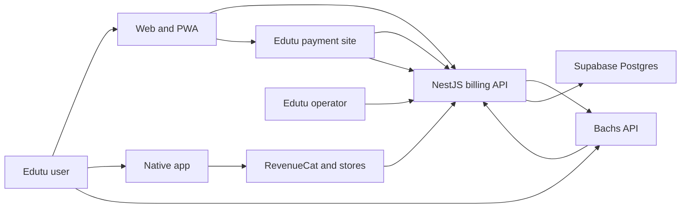

# pay.edutu.org and Edutu Billing Threat Model

## Executive summary

Edutu's payment system is not ready for Bachs production traffic. The live Bachs webhook URL returns `404`, while the only local Bachs handler verifies a signature and then acknowledges every event without fulfillment. The larger structural risk is that Paystack, RevenueCat, the Next.js pay app, the NestJS backend, and three partially overlapping ledgers can each mutate subscription state. Their writes are not atomic, they use inconsistent user identifiers, and a single aggregate entitlement row cannot safely represent simultaneous Bachs and native-store purchases. The target state should make the NestJS billing module the only payment authority, use Bachs-hosted checkout and customer portal for web payments, retain RevenueCat for native IAP, and derive Pro from immutable provider-specific grants.

## Scope and assumptions

In scope:

- `pay-edutu-org/` Next.js checkout, return, account, admin, provider, and database code.
- `backend/services/services/api/src/billing/`, backend authentication identity mapping, and server-side Pro checks.
- `edutu-web-app/` and `edutumobile/` payment initiation and status consumption.
- `edutumobile/supabase/functions/revenuecat-webhook/` and billing-related Supabase migrations.
- The public deployments at `pay.edutu.org` and `edutu-platform.onrender.com`.
- Bachs checkout, webhooks, subscriptions, recovery, refunds, disputes, and customer portal integration boundaries.

Confirmed product assumptions:

- Bachs will own all web/PWA payments: Pro subscriptions, season passes, and credit packs.
- RevenueCat remains the native App Store and Play Store payment rail.
- A user may have active purchases from more than one rail; Pro remains active while any valid grant is active. Recurring plans coexist and do not stack artificial extra days.
- Bachs failed-renewal recovery is honored. Full refunds and chargebacks suspend the affected grant; partial refunds require review.
- Edutu UI remains on `pay.edutu.org`; card, bank, mobile-money, crypto, and customer-portal payment UI remains Bachs-hosted.
- Bachs currently documents recurring products as USD-card-only. Local non-card methods therefore buy clearly labeled bounded access passes and do not promise automatic renewal unless Bachs expands recurring-method support.

Out of scope:

- Bachs, Paystack, RevenueCat, Apple, Google, Clerk, Vercel, Render, and Supabase internal platform security.
- Cardholder-data processing inside Bachs or native stores; Edutu should never receive card numbers.
- Tax, accounting, and jurisdiction-specific legal advice.

Open questions that do not block the architecture but affect later policy configuration:

- Exact grace access during Bachs `past_due`: current-period end only, or an additional Edutu grace period.
- Whether chargebacks suspend only the disputed grant or the entire account pending fraud review. This model assumes the disputed grant only unless coordinated fraud is detected.
- The final stable API hostname. The recommendation is `api.edutu.org`; the current Render hostname can be used temporarily.

## System model

### Primary components

- Edutu web/PWA and mobile web initiate web purchases.
- Native iOS/Android uses RevenueCat and the platform stores.
- `pay.edutu.org` presents Edutu-owned purchase status, return, support, and account-management UI.
- The NestJS billing module should authenticate users, create provider sessions, receive webhooks, and own ledger/entitlement mutations.
- Bachs hosts checkout and customer-portal UI and sends at-least-once signed webhooks.
- RevenueCat sends native purchase lifecycle webhooks.
- Supabase/PostgreSQL stores checkout intents, provider events, transactions, subscriptions, grants, and the compatibility entitlement projection.

### Data flows and trust boundaries

- Browser/mobile web → NestJS API: product key, return context, and an idempotency key over HTTPS. Clerk bearer authentication must determine the raw auth subject; client `uid`, amount, currency, email, and provider IDs are not authoritative. The current direct URL flow does not meet this requirement (`edutu-web-app/src/services/billing.ts:createCheckout`, `edutumobile/lib/pricing.ts:buildCheckoutUrl`).
- NestJS API → Bachs API: server-owned product IDs, customer identity, unique Edutu checkout reference, return URLs, and metadata over HTTPS with a server-only scoped API key and `Idempotency-Key`.
- User agent → Bachs hosted checkout: a short-lived Bachs checkout URL. Bachs owns payment data collection; Edutu receives only provider references and lifecycle state.
- Bachs → NestJS webhook: exact raw JSON body plus `X-Bachs-Timestamp` and `X-Bachs-Signature`. Verification is HMAC-SHA256 over `timestamp.raw_body`, with a five-minute freshness window and constant-time comparison (`backend/services/services/api/src/billing/billing.service.ts:verifyBachsSignature`).
- RevenueCat → webhook processor: native purchase events authenticated by a configured authorization secret. The current Supabase function performs static-secret validation and environment checks (`edutumobile/supabase/functions/revenuecat-webhook/index.ts:87-161`).
- Billing processor → PostgreSQL: integrity-critical writes. Event claim, transaction, subscription, grant, and projection updates must be one transaction or a durable inbox plus retryable worker. Current Paystack and RevenueCat flows contain partial-write gaps.
- Browser → `pay.edutu.org`: return/status and account-management UI. A browser redirect is never proof of payment and must not grant Pro.
- Admin → billing operations: refunds, manual grants, reconciliation, and support actions. Clerk admin RBAC, MFA, CSRF protection, and immutable audit records are required; the current pay app uses one static bearer token.

#### Diagram

## Assets and security objectives

| Asset | Why it matters | Security objective |
| --- | --- | --- |
| Bachs, Paystack, RevenueCat, Supabase, and admin secrets | Compromise enables forged operations, data access, or payment abuse | Confidentiality, integrity |
| Checkout intent | Binds one authenticated user to one product, amount, currency, environment, and provider session | Integrity |
| Provider event inbox | Proves what was received and whether it was processed exactly once | Integrity, availability |
| Payment ledger | Financial and support record; must preserve amounts, currencies, refunds, and environment | Integrity, availability |
| Provider subscriptions | Controls renewal, cancellation, dunning, and customer-portal access | Integrity, availability |
| Entitlement grants | Determines access users paid for; must survive retries and overlapping providers | Integrity, availability |
| Clerk auth subject mapping | Prevents payments and entitlements from attaching to the wrong account | Integrity |
| Customer PII and provider payloads | Includes email, name, payment metadata, and support references | Confidentiality |
| Revenue and reconciliation reports | Used for operational and financial decisions | Integrity, availability |
| Public payment and webhook endpoints | Downtime can lose checkouts or delay fulfillment | Availability |

## Attacker model

### Capabilities

- An unauthenticated internet user can call public checkout, return, health, and webhook URLs and alter query strings, headers, JSON, and request frequency.
- An authenticated user can alter client code, replay requests, choose arbitrary client-supplied identifiers, open multiple tabs, and race checkout creation.
- A malicious payer can abandon, underpay, overpay, dispute, refund, or retry using supported provider flows.
- Anyone who obtains a sandbox or static admin/webhook secret can exercise the privileges of that credential until it is rotated.
- Provider webhooks can be duplicated, delayed, replayed, or delivered out of order without malicious intent.
- Operators can make configuration mistakes, including wrong product IDs, wrong environment keys, stale webhook URLs, or open redirects.

### Non-capabilities

- A normal remote attacker cannot forge a correctly implemented Bachs or Paystack HMAC without the endpoint secret.
- A normal remote attacker cannot directly write service-role-protected billing tables unless a credential or privileged endpoint is compromised.
- Edutu does not process raw card details when using Bachs-hosted checkout or native IAP.
- This model does not assume compromise of Bachs, Clerk, Supabase, Vercel, Render, Apple, or Google.

