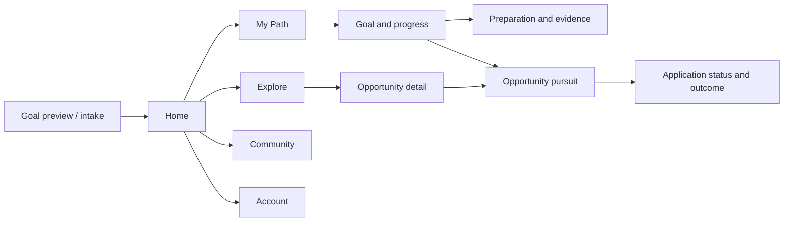
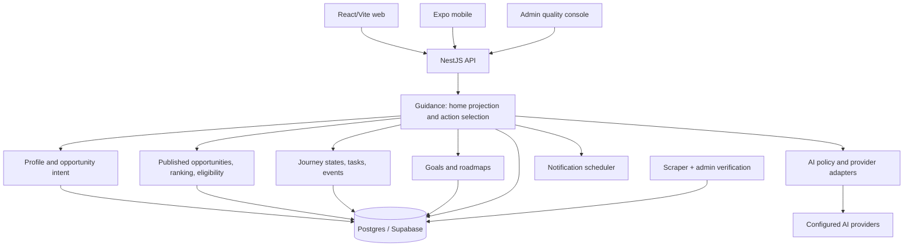

# Edutu 2.0: product, interface, and guidance architecture

**Status:** Reviewable proposal, 28 September 2026. This supersedes the first decision-to-progress roadmap. No production feature has been changed.

## 1. Strategic choice

**Promise:** “Know your next step. Get help taking it.” Edutu should turn a person's goal and current constraints into a credible decision, a small plan, and observable progress. Opportunities are valuable supply; guidance and execution are the product experience.

**Initial segment assumption:** Students and early-career people seeking scholarships, internships, fellowships, and first jobs. Confirm the highest-pain segment in interviews before narrowing marketing. The broader “career operating system” vision is a destination, not a claim Edutu should make now.

| Entry mode | User's question | First useful response |
| --- | --- | --- |
| Unsure | “Which direction is worth exploring?” | Two or three possible paths and one reversible exploratory action. |
| Goal known, preparing | “What is holding me back?” | A specific gap, the evidence behind it, and a preparation step. |
| Ready to apply | “Which opportunity should I pursue?” | A small explained shortlist, deadline, effort, eligibility, and an application path. |

**Product loop:** Understand → Decide → Commit → Prepare → Apply or complete → Record outcome → Revise. Every session should offer a clear continuation of this loop.

## 2. Code-backed audit

| Current asset | Evidence | Product gap |
| --- | --- | --- |
| Landing page leads with AI and global programs | `edutu-web-app/src/components/LandingPageV3.tsx` | It promises discovery rather than a concrete decision or result. |
| Four-step personalization captures identity, education, interests, ambitions | `edutu-web-app/src/components/PersonalizationScreen.tsx` | Immediate blocker, time available, prior attempts, and a first-answer transition are absent. |
| Web and mobile homes emphasize categories and opportunity rails | `edutu-web-app/src/components/Dashboard.tsx`; `edutumobile/app/(app)/index.tsx` | Browsing receives more visual priority than the next action. |
| Opportunity-home returns intent, next action, up to three pursuits, and three default recommendations | `backend/services/services/api/src/opportunity-journeys/opportunity-home.service.ts` | Existing decision data is not the dominant web home experience. Confirm mobile usage in integration. |
| Shortlist supplies fit reasons, risks, eligibility, effort, deadline | `opportunity-shortlist.service.ts` and `opportunity-decision-support.ts` in the API | Explanations need source freshness, correction, and distinct treatment of unknown facts. |
| Opportunity journeys include states, templates, required tasks, event log, and next-action derivation | `opportunity-journeys/` and `db/opportunity-journey.schema.ts` | The plan is tied to an opportunity. Someone who needs preparation before choosing one falls back to discovery. |
| Goals, roadmaps, CV, applications, and reminders already exist | API modules and web/mobile screens | These capabilities feel like separate destinations rather than parts of one user path. |
| Admin activation counts a bookmark or application | `backend/services/services/api/src/admin/admin.service.ts` | A bookmark is a weak proxy for meaningful progress. |

This is a repository audit, not a live usability or production analytics audit. The NestJS API lives in the nested `backend/services/services/api/` path. The Expo app is a separate Git repository.

## 3. Information architecture and interaction design

**IA thesis:** Organize the product by what a person is trying to do now, then by the stage of their path. A feature should be reachable from the task where it helps; it does not automatically need a top-level tab.



**Proposed navigation:** Web: Home / My Path / Explore / Community / Account. Phone: Home / Plan / Explore / More, with Community visible inside More until research supports a fifth tab. Saved items live in Explore; applications and roadmaps live in Plan; CV opens contextually from a preparation task and remains available in tools. Preserve existing URLs as aliases until task-based tree tests show the new labels work.

### Screen specification

| Screen | First viewport | Primary action | Critical states |
| --- | --- | --- | --- |
| Public landing | Outcome headline, worked example input → advice → action, credible proof | **Find my next step** | Returning member sees **Continue my plan**; exploration stays available. |
| Quick intake | One goal, current stage, main blocker; only facts needed for first advice | **Show my next step** | “I’m unsure,” skip, edit inferred facts, save later. |
| First answer | One action, short reason, up to three relevant options | **Start this plan** | Unknown eligibility asks for one fact; weak data gives a transparent exploratory answer. |
| Home | One next action, why, due date, active pursuit; shortlist below | **Continue** | New, active, stalled, done, offline, stale opportunity, service unavailable. |
| Opportunity detail | Verified source/deadline, eligibility verdict, fit reasons and risks, effort, requirements | **Start plan** or **Continue plan** | Expired, unverified, missing source, unclear eligibility, already active. |
| My Path | Goal, primary pursuit, next task, evidence, secondary pursuits, application states | **Complete next task** | No opportunity yet, overdue, waiting for referee, waiting for external outcome. |
| Review | Completed steps, applications and outcomes, what changed | **Update my goal** or **Keep going** | Self-reported outcomes clearly labeled; no invented readiness score. |

**First-session flow:** Offer a worked advice preview before demanding a complete profile. Ask one goal, current position, obstacle, and the smallest eligibility fact set. Reuse saved profile data, but distinguish user-declared from inferred data. Present a useful answer; account creation saves the plan. Test the preview-versus-signup order with real visitors.

**Returning flow:** Resume an active next task. If a deadline or verified requirement changed, show what changed and offer a revision. After an external application link is opened, ask whether it was submitted; never infer submission from the click. A rejection leads to a review of evidence and alternatives, not a lower personal “score.”

**Visual direction:** Use Edutu's Outfit/Instrument Sans and existing blue/cyan tokens. The strongest panel is the current action; supporting content is calm and text-led. Use photographs where they identify an opportunity or person, not as decoration around tasks. On a narrow phone, the next action, reason, and button precede the recommendation rail. Controls should be at least about 44 px, keyboard focus visible, copy understandable without icons/color, and motion reducible. The [static home concept](./2026-09-28-guidance-home-concept.html) illustrates the hierarchy with sample content; it is not connected to live data. [Nielsen Norman Group's progressive disclosure guidance](https://www.nngroup.com/articles/progressive-disclosure/) supports showing common actions first, while Edutu's exact hierarchy needs user testing.

## 4. Product capabilities and sequencing

| Capability | First release: reuse and connect | Later, if validated |
| --- | --- | --- |
| Goal and constraints | Confirm or edit existing opportunity intent; capture immediate blocker. | Multiple goals, one active focus, goal history. |
| Decision support | Reuse shortlist, deterministic eligibility, deadline, effort, dismissals. | Compare unlike options: course, project, mentor, opportunity. |
| Path | Reuse opportunity journeys and task templates. | Goal-level preparation steps before an opportunity exists. |
| Application support | Link existing CV, documents, deadlines, and application tracker from the relevant task. | Evidence locker and reusable application packet with explicit consent. |
| AI guidance | Structured explanation of verified facts; template fallback. | Editable plan drafting and revision after offline evaluation. |
| Feedback | “Not relevant,” reason, task status, application outcome. | Outcome-aware ranking with a visible reason when advice changes. |
| Accountability | Existing quiet-hour-aware reminders for actual tasks/deadlines. | User-selected check-ins and mentor escalation. |

**First two releases exclude** a new general chatbot home, automated application submission, a new course marketplace, a universal career-readiness percentage, and a broad microservice rewrite. These would increase scope before Edutu proves the decision-to-action loop.

## 5. Target technical architecture

### Decision: modular monolith

Create a **Guidance domain inside the existing NestJS API**. It composes Profile, Goals, Opportunity Intent, Ranking/Eligibility, Journeys, AI routing, and Notifications. Postgres/Supabase stays the source of record; Clerk remains the auth boundary. Both clients consume one typed guidance contract. No new runtime, vector database, or autonomous agent is required for the first release.



**Existing foundations:** `opportunity-home` already returns a limited decision payload; journey mutations use idempotency and versioning; AI routes have provider policy, fallback, cost logging, and server-only keys. Preserve the current documented migration and direct-Supabase compatibility boundaries in `docs/ARCHITECTURE.md` and `docs/DATA_MODEL.md`.

### Interfaces and data ownership

**Release 1:** Consume current `GET /me/opportunity-home`, `PUT /me/opportunity-intent`, and journey/task routes through typed client adapters. Extend the response only for stable action targets, source freshness, or missing-fact prompts. Add a `schemaVersion` if the shape changes. Do not duplicate business rules in web or mobile.

**Release 2 proposed API:** `GET /me/guidance-home`, `PUT /me/active-goal`, `GET /me/goals/:id/plan`, `PATCH /me/goals/:id/plan-steps/:stepId`, `POST /me/guidance-feedback`. These routes do not exist yet. The home payload should include `schemaVersion`, `generatedAt`, goal, one next action, active pursuits, suggestions, `degraded`, and reason codes. All mutations require auth, ownership checks, idempotency keys, and optimistic version checks for concurrent changes.

**Existing tables:** `profiles` owns stable user facts; `goals` owns longer-term aims; `opportunity_intents` owns current search constraints (currently one active intent per user); `user_opportunity_journeys` and tasks own a specific pursuit; `opportunity_journey_events` is the immutable transition trail. Do not use profile JSON as a second plan database.

**Later schema, only after generic preparation is validated:** `goal_plans(goal_id, version, status, reviewed_at)`; `goal_plan_steps(plan_id, kind, title, due_at, status, source, evidence_required)`; `goal_evidence(user_id, step_id, kind, storage_ref, verification_status)`; `guidance_decisions(user_id, goal_id, action_kind, rationale, source_ids, model_version, input_snapshot_hash, expires_at)`. A later multiple-goal model must change the current one-active-intent-per-user uniqueness deliberately. Document ownership, RLS, migration source, and retention before creating tables.

### Decision pipeline

1. **Read context:** Explicit goal, confirmed intent, stable profile, active journeys, completed tasks, dismissals, time horizon, weekly hours, and consented evidence. Mark inference as inference; ask the user to confirm it before strong advice.
2. **Retrieve:** Published, non-expired, verified opportunities with official URL, source and verification timestamp. Exclude past rejects/active pursuits according to policy.
3. **Check eligibility:** Structured hard rules first. Missing information yields `unclear` and one useful question. A match score cannot overturn a verified blocker.
4. **Rank:** Balance goal fit, feasibility, deadline, estimated effort, readiness mode, and feedback. Store reason codes. Keep a deterministic, explainable fallback.
5. **Choose action:** If a primary pursuit exists, show its required task or follow-up. Otherwise suggest one preparation step or one opportunity decision. The user may defer, reject, or change it.
6. **Explain:** AI may turn structured facts into plain language and suggest an editable plan. It may not alter eligibility, official deadline, task state, or official URL. Validate a structured output schema, constrain claims to supplied evidence, and fall back to templates on timeout or bad output.
7. **Learn:** Track impressions, decisions, task completion, application confirmation, and outcomes separately. Recompute when material facts change and explain why the advice changed.

This approach follows [Google's People + AI patterns on explanation and user control](https://pair.withgoogle.com/guidebook-v2/patterns) and [NIST's AI risk-management framework](https://www.nist.gov/publications/artificial-intelligence-risk-management-framework-ai-rmf-10). These are design principles, not validation of Edutu's model.

**Operational requirements:** Do not put model generation on the critical home render; serve a current projection or deterministic fallback. Show stale/offline status and never treat an expired opportunity as current. Establish a p95 latency budget after measuring baseline. Keep AI keys server-side, feature-level cost ceilings, and prompt-content sampling off by default. User documents need explicit AI consent, narrow access, deletion/retention, and privacy review. Use existing notification preferences, quiet hours, dedupe, and time zones. Keep aggregate quality visible to admins without unrestricted private plan content.

### Architecture trade-offs and first-slice file map

| Option | Benefit | Cost | Decision |
| --- | --- | --- | --- |
| Keep independent feeds, goals, roadmaps, and journeys | Almost no backend change | Users and clients must assemble conflicting state | Reject as the long-term experience. |
| Add a Guidance domain inside NestJS | Reuses canonical rules and DB, one cross-client contract, reversible rollout | Requires careful ownership boundaries and contract tests | **Choose.** |
| Launch a standalone AI agent service | Flexible conversational workflow | Another runtime, latency, cost, harder factual guarantees | Defer until a proven use case cannot fit the API. |

The first slice should be an orchestration and UI change, not a schema rewrite:

| Proposed change | Location | Responsibility |
| --- | --- | --- |
| Typed opportunity-home client and response parser | `edutu-web-app/src/services/opportunityJourneys.ts` or a focused sibling | Turn unknown API data into a stable screen model; reject malformed response safely. |
| Next-action home section | A focused component imported by `edutu-web-app/src/components/Dashboard.tsx` | Render new, active, empty, degraded, and loading variants with one primary CTA. |
| First-answer transition | `edutu-web-app/src/components/PersonalizationScreen.tsx` and route wiring in `App.tsx` | Save/confirm intent then land on useful advice, with retry and edit. |
| Backend projection and reason codes | `backend/services/services/api/src/opportunity-journeys/opportunity-home.service.ts` | Supply stable action target, source freshness, and missing-fact prompt if the present response lacks them. |
| Instrumentation | Existing journey events plus a focused web event adapter; admin funnel service | Separate exposure, decision, start, completion, and outcome; preserve existing funnel. |
| Mobile parity in a later slice | `edutumobile/app/(app)/index.tsx` and a shared core API adapter | Use the same response semantics; native presentation and offline behavior remain mobile-owned. |

**Illustrative versioned response for the later Guidance API** (the first slice may use the existing endpoint):

```json
{
  "schemaVersion": 1,
  "generatedAt": "2026-09-28T09:00:00Z",
  "goal": { "id": "goal-id", "title": "Funded master's in data science", "source": "explicit" },
  "nextAction": {
    "kind": "journey_task",
    "targetId": "task-id",
    "title": "Request your transcript",
    "reasonCodes": ["required_document", "lead_time"],
    "dueAt": null
  },
  "primaryPursuit": { "journeyId": "journey-id", "completedRequired": 2, "totalRequired": 5 },
  "suggestions": [],
  "degraded": false,
  "missingFacts": []
}
```

The client should render a valid action without requiring `suggestions`. It should render a useful exploratory state when `nextAction` is null. A degraded response must say that matching is temporarily limited; it must not pretend to be a personalized diagnosis.

**State invariants:** At most one active primary opportunity pursuit per user, as the current database enforces; task completion requires a confirmed mutation before counting in the North Star; a self-reported application is marked as such; an expired opportunity can remain in history but cannot be recommended as open; inferred goal data never silently overwrites an explicit user choice. Keep all transitions idempotent so a phone retry cannot duplicate events or tasks.

**Rollout:** Contract test API response → internal staff accounts → small new-user cohort on web → compare quality and task completion → expand web → mobile parity. A feature flag returns the current dashboard on failure; disabling AI explanation falls back to deterministic reason copy independently. Preserve old URLs and historical journeys throughout.

## 6. Delivery plan: independently shippable slices

Timings assume a small cross-functional team and must be reforecast after scoping.

| Slice | Lead | Deliverable | Acceptance gate |
| --- | --- | --- | --- |
| **A. Evidence, weeks 1–2** | Product + research + data | 8–12 interviews across entry modes; five-task usability benchmark; funnel baseline and event dictionary. | Name the dominant blocker and choose the initial segment. |
| **B. Decision home, weeks 3–6** | API + web + design | Feature-flagged next-action home using existing opportunity-home; explained three-choice shortlist and honest empty/error/offline states. | New user reaches a concrete action; returning user resumes; browse route still works; contract/visual checks pass. |
| **C. First-session conversion, weeks 5–8** | Growth + web + design | Outcome-led landing example and CTA; editable short intake; first-answer preview/save flow. | Controlled comparison of qualified signup → useful answer and first task; relevance guardrail holds. |
| **D. Cross-device pursuit, weeks 7–12** | API + mobile + web | Shared next action, plan state, application confirmation, contextual CV/documents, follow-up. | Start on one device and continue on another; outbound click does not count as submission. |
| **E. Goal-level preparation, months 4–5** | API + AI + design | Goal plan steps and evidence model; editable AI plan drafts behind evaluation gate. | Human review and test cases show useful advice with no invented eligibility/deadline claims. |
| **F. Optimization, month 6 onward** | Product + data | Outcome-aware feedback, reminder tuning, experiments, pricing-fit review. | More meaningful actions and D30 retention without quality or fatigue regression. |

**Program ownership:** Product owner decides segment/scope/copy; API owns contracts and data; design owns hierarchy and research; growth owns acquisition experiments; mobile owns native interactions; data owns metric validity; operations owns source verification and AI evaluations. Each slice needs a release flag, rollback path, migration owner, and support-state checklist.

**Release 1 definition of done:** The five user cases (new, active, stalled, unclear eligibility, API degraded) each show one understandable next action or a clear recovery step. The action reaches a real route and updates only after server confirmation. Both phone and desktop layouts are usable with keyboard and screen reader. Eligibility copy is consistent with the backend verdict. Analytics can join exposure → action → task completion by user and cohort without counting retries twice. No unpublished or expired opportunity enters the shortlist.

## 7. Measurement and learning

**North star candidate:** Weekly distinct users completing a **meaningful next action tied to a declared goal**. Count completion of a required preparation step, confirmed application submission, or verified milestone once per action. Do not count bookmarks, impressions, chats, or external clicks. Validate the metric against D30 retention and eventual opportunity outcomes.

**Funnel:** landing viewed → goal selected → first answer seen → account saved → pursuit started → first required task completed → application confirmed or other milestone completed → D7/D30 return → outcome. Segment by entry mode, goal, acquisition source, and platform. Preserve the old admin funnel during transition.

**Event definitions:** `guidance_answer_viewed` fires only when a real answer is visible; `guidance_action_accepted` when the user chooses it; `journey_started` after the server confirms the journey; `required_task_completed` after a persisted task transition; `application_link_opened` is observational; `application_submitted_self_reported` requires explicit confirmation; `outcome_recorded` stores the stated outcome source. Include `goal_id`, `journey_id`, `platform`, `cohort`, and response/version identifiers where applicable. Avoid raw CV text or sensitive answers in telemetry.

**Metric denominators:** First-answer rate = unique signups shown an answer / unique signups assigned to a cohort. Seven-day first-action rate = unique new users with a confirmed required step or pursuit action within seven days / unique new users who received an answer. D30 retention = users with a meaningful action or plan review on day 30 window / eligible signup cohort; define the exact day window before reporting. Show sample size and confidence interval in experiment reviews.

**Quality scorecard:** User-rated recommendation relevance, eligibility errors, expired/dead-link rate, explanation factuality and source coverage, task abandonment, time to first useful action, notification opt-outs, cost per useful answer, and support complaints. Set numerical targets after baseline; do not invent lift.

**Evaluation set:** Blinded scholarship, internship, job, and fellowship cases; include missing profile facts, conflicting requirements, near deadlines, inaccessible sources, weak match but strong aspiration, rejected applicants, and underserved geographies. Human reviewers assess whether advice is useful, factual, appropriately uncertain, and actionable. Test deterministic fallback independently from AI prose.

**Experiment order:** (1) Next-action-first versus category-first home, primary endpoint meaningful action in seven days; (2) outcome-led landing versus current hero, primary endpoint qualified users reaching a first answer; (3) short versus existing intake, relevance and missing-fact guardrails; (4) concise explanation versus full rationale, endpoint correct decisions and trust. Avoid overlapping first-session tests without assignment rules. [Baymard's visible-field research](https://baymard.com/research-articles/checkout-flow-average-form-fields) motivates testing shorter intake; ecommerce results are not an Edutu conversion estimate.

## 8. Risks and decisions

| Risk | Design or engineering response |
| --- | --- |
| Wrong “do not apply” advice harms users | Only verified hard blockers trigger a stop; otherwise say “check this requirement,” offer preparation, and permit override. |
| AI fabricates claims | Server-owned structured facts, source links, schema validation, template fallback, offline evaluation. |
| Goals, intents, roadmaps, and journeys diverge | Explicit ownership and links; one home projection; no client-side shadow state. |
| Short intake reduces match quality | Ask progressively when a specific missing fact changes the answer; monitor `unclear` and user relevance. |
| More notifications create fatigue | Trigger from task/deadline changes; respect preferences, quiet hours, dedupe; measure opt-outs. |
| Cross-repo parity slips | Shared API contract tests and a cross-device journey in each mobile release. |
| Growth work rewards weak signups | Optimize useful action and outcome quality, not raw registrations. |

**Founder/product choices to review:** Select the first segment; choose preview-before-signup versus signup-before-answer; approve the proposed navigation for testing; define data/retention rules for later evidence features. The decision-home slice can be scoped while those answers are gathered.

## 9. Evidence limits

This plan is based on repository code and architecture docs, plus cited primary UX/AI guidance. It does not claim live production behavior, actual conversion rates, validated user preferences, or a proven recommendation model. Before shipping, inspect live data, run usability sessions, test API contracts and accessibility, and release behind a feature flag.
