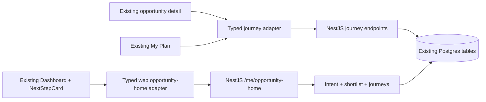

# Incremental web guidance implementation plan

> **For agentic workers:** Use `superpowers:executing-plans` to implement this plan task by task. Check boxes track delivery. Read the spec before changing code.

**Goal:** Help a web user see a relevant next step, start a plan, complete preparation, and report an application outcome while keeping Edutu's current interface recognizable.

**Architecture:** Extend the existing React/Vite web app through small components inside its current dashboard, opportunity detail, onboarding, and My Plan pages. Reuse the NestJS `opportunity-home`, intent, shortlist, and journey APIs, with Supabase/Postgres as their existing source of record. The API chooses actions and owns eligibility; the browser renders them and records user actions. A broad Guidance domain and goal-level plan database belong to a later project.

**Tech Stack:** React 18, TypeScript, Vite, Tailwind, Clerk, Zod, Vitest; NestJS, Drizzle, Postgres/Supabase.

**Spec:** [Edutu 2.0 product and guidance architecture](../../product-strategy/2026-09-28-edutu-v2-product-architecture.md). This plan deliberately narrows that proposal to additive changes for **web only**; it does not adopt the proposed navigation redesign.

## Global constraints

- Keep the current routes, sidebar, mobile tabs, category tiles, opportunity rails, colors, typography, and four-step onboarding layout. Add guidance within those surfaces.
- Preserve the client → NestJS API → database boundary and existing Clerk authentication. Do not call Supabase directly for new guidance data or put an AI key in the browser.
- Do not treat match scores as admission odds, an external application click as submission, or inferred intent as an explicit choice.
- A task counts as complete only after the API confirms it. Keep idempotency and `expectedVersion` on journey mutations.
- This plan touches `edutu-web-app/` and the nested backend at `backend/services/services/api/`. It does not require a mobile release or new database tables for the first three milestones.
- `Dashboard.tsx` and `DashboardUpdatePopup.tsx` currently have unrelated local modifications. Preserve them and resolve integration against the latest working tree; do not overwrite them.

## What users will see

| Existing screen | Small change | Keep as is |
| --- | --- | --- |
| Dashboard | A compact “Your next step” card above the category tiles. Active users see the current task; new users see one explained opportunity and a route to its detail. | Current category tiles, profile prompt, activity strip, recommendation rails, navigation. |
| Opportunity detail | A short “Why it fits / what to check” summary using existing match and eligibility data; after “Add to My Plan,” offer a direct link to that plan. | Existing hero, sections, CTA treatment. |
| Four-step onboarding | After save, take the user to the dashboard's first answer and focus it. | Current four steps, questions, and visual flow. |
| My Plan | Make the primary pursuit and its next task clearer; add explicit application-opened, submitted, and outcome actions within the existing detail page. | Current stages, cards, task list, and routes. |
| Public landing | One supporting line and example emphasizing a concrete next step; test copy after event baseline exists. | Layout, hero art, CTAs, sign-in flow. |

Mobile layout remains the same vertical flow: compact next-step card, category tiles, then current content. The card should use existing `surface`, `brand`, spacing, focus, and button styles. No new full-screen wizard, chatbot, or dashboard shell.

## First-release architecture

`GET /me/opportunity-home` already returns `intent`, `activePursuits`, `nextAction`, three recommendations, `degraded`, and reason codes. `PUT /me/opportunity-intent` accepts explicit search intent. Journey routes already start a pursuit, update a task, and record application/outcome transitions. The web app has `opportunityJourneys.ts`, My Plan pages, and server-backed task completion. **A new AI service, agent, vector store, migration, or new top-level navigation is unnecessary for this release.**

One API correction is needed before using the home action: `opportunity-home.service.ts` currently takes `activePursuits[0]`; the repository sorts pursuits by next-action/deadline time, not primary priority. Select the primary pursuit explicitly, return the corresponding journey ID with the action, and define what to do if no primary exists. Otherwise the card can tell users to work on a secondary pursuit while My Plan shows a different focus.

## Review focus

These are the five highest-risk conditions to test within the tasks below:

1. An active primary and an earlier-due secondary pursuit: show the primary action, unless the product owner explicitly chooses a deadline override and the API explains it.
2. Inferred or missing intent: say what was inferred, offer a small correction path, and avoid an overconfident “best match” claim.
3. Empty, degraded, malformed, 401, offline, or timed-out home response: preserve the existing dashboard and give a usable retry/browse route.
4. Expired, ineligible, or unclear recommendation: never show it as an open, eligible next application action; ask for a fact or show a safe alternative.
5. A task or application mutation retried after a slow response or version conflict: never show success or count completion until the server confirms the final state.

## Delivery sequence and file map

### Task 1 — Lock the home contract and primary-action rule

**Files:** Modify `backend/services/services/api/src/opportunity-journeys/opportunity-home.service.ts`; test in `opportunity-home.service.spec.ts`. If response needs a stable action target, add it to this endpoint rather than deriving it from array position in the browser.

**Interface:** `getHome(userId, requestedLimit)` returns one `featuredPursuitId: string | null` alongside `nextAction`; `nextAction` comes from that featured pursuit. Prefer `journey.priority === "primary"`; fall back to the first active pursuit only if no primary exists. Retain existing response fields for compatibility.

- [ ] Add a failing service test with primary and secondary journeys in deadline order and assert the primary ID and its task are selected. Add a no-primary fallback case.
- [ ] Implement the selection without changing list ordering or existing journey limits.
- [ ] Run the focused API test and backend type/lint check. Confirm the route still returns a useful action when recommendations are degraded.
- [ ] Commit the API change separately.

### Task 2 — Add a safe typed web home adapter

**Files:** Create `edutu-web-app/src/services/opportunityHome.ts`; add `edutu-web-app/src/test/__tests__/opportunityHome.test.ts`. Reuse `productApiRequest` from `src/services/productApi.ts`.

**Interface:** `getOpportunityHome(token: string): Promise<OpportunityHomeView>`. Parse the API response with Zod; expose intent source, featured pursuit ID, action label, recommendation ID/title/reasons/eligibility/deadline, and degraded state. Invalid or missing optional recommendations must not discard a valid active action. Do not assemble eligibility or ranking in the client.

- [ ] Test active, no-pursuit, empty, degraded, malformed, and request-error responses; assert a malformed response fails safely without hiding the old dashboard.
- [ ] Implement the adapter and explicit error classification. Keep the existing `opportunityJourneys.ts` mutation functions as the source for writes.
- [ ] Run `npm run test -- src/test/__tests__/opportunityHome.test.ts` and `npm run typecheck` in `edutu-web-app/`.
- [ ] Commit the adapter and tests.

### Task 3 — Insert one next-step card in the existing dashboard

**Files:** Create `edutu-web-app/src/components/dashboard/NextStepCard.tsx` and `src/components/dashboard/__tests__/NextStepCard.test.tsx`; make one small insertion in `src/components/Dashboard.tsx`, immediately before the current “Explore Opportunities” section. Add copy in `edutu-web-app/src/i18n/locales/{en,es,fr,de,zh,ar}.json`.

**Interface:** `NextStepCard` takes a parsed home view, load state, and navigation callbacks. Active: show task label, pursuit title, deadline if known, and **Continue plan** → `/app/my-plan/:journeyId`. No pursuit: show one explanation from a safe recommendation and **View opportunity** → existing detail route. Missing facts or empty: **Explore opportunities** → `/app/opportunities`. Inferred intent is labeled “Based on your profile” and gets **Edit preferences** → `/app/personalization` as a secondary action. Degraded or failed fetch never blocks the rest of the dashboard.

- [ ] Test every card state and the exact CTA destination; test keyboard focus and screen-reader labels.
- [ ] Implement compact desktop and phone variants with current Tailwind tokens. Do not duplicate recommendation rails or introduce another modal.
- [ ] Fetch only for signed-in users; cancel/ignore stale responses after auth changes; render the existing dashboard immediately while this data loads.
- [ ] Run focused tests, `npm run typecheck`, and `npm run build`. Review desktop and 390 px phone screenshots for layout shift, clipping, and hierarchy.
- [ ] Commit the dashboard slice after reconciling current uncommitted changes.

**Ship gate A:** In a staff account, an active journey opens its own detail from the card; a new account reaches an existing opportunity detail; the page remains fully usable when `opportunity-home` fails. This is the **minimum useful release**.

### Task 4 — Improve the decision at the opportunity detail

**Files:** Modify `edutu-web-app/src/components/OpportunityDetail.tsx` and, if needed, `src/components/opportunity/MatchInsights.tsx`; extend existing tests in `src/components/opportunity/__tests__/MatchInsights.test.tsx` and add an interaction test for the plan handoff.

**Interface:** Use the existing match/eligibility/deadline fields to show up to two reasons, one meaningful risk or missing fact, and a link to the official source. After `createOpportunityJourney` succeeds, use the returned `journey.id` to offer **Continue in My Plan**. Keep the user on the detail page if creation fails. Avoid duplicating the existing match panel if it already presents these facts clearly; improve its copy and placement instead.

- [ ] Test `eligible`, `unclear`, `ineligible`, expired, and missing-source states, including no implied admission probability.
- [ ] Test that the plan link appears only after a confirmed creation and uses the returned ID.
- [ ] Implement the small copy/handoff changes and run focused tests, typecheck, and build.
- [ ] Commit this decision-support slice.

### Task 5 — Make the first saved answer useful, within current onboarding

**Files:** Modify `edutu-web-app/src/components/PersonalizationScreen.tsx`; use `src/services/opportunityHome.ts`; add a focused onboarding test under `src/test/__tests__/`. Adjust `Dashboard.tsx` only if a lightweight one-time highlight is needed.

**Interface:** Preserve all four steps and questions. After profile save, navigate to dashboard and focus/highlight the next-step card; no blocking AI call or extra signup step. The home API can infer intent from profile data, but its `source` must remain visible. A separate explicit-intent editor is deferred because `PUT /me/opportunity-intent` requires `goalKey`, `actionHorizonDays`, `weeklyHours`, and `readinessMode`, which the present onboarding does not collect. The browser must not invent these values.

- [ ] Write tests for saved profile → dashboard answer, save failure, and inferred-intent wording.
- [ ] Keep existing profile persistence. Let the backend infer opportunity intent until a separate explicit-intent form collects all required fields. Do not silently assign weekly hours or readiness.
- [ ] Run focused tests and typecheck; manually check the four-step flow with keyboard and a narrow viewport.
- [ ] Commit this onboarding slice.

### Task 6 — Complete the pursuit and application loop in My Plan

**Files:** Extend `edutu-web-app/src/services/opportunityJourneys.ts` and `src/test/__tests__/opportunityJourneys.test.ts`; modify `src/components/MyPlanPage.tsx` and `src/components/MyPlanDetailPage.tsx`; add focused detail-page tests.

**Interface:** Add typed wrappers for `POST /me/opportunity-journeys/:id/application-opened`, `/application-confirmed`, and `/outcome` using a stable `idempotencyKey` per attempted action and the current `expectedVersion`. Keep the task list and stage tabs. Show **Open application** only when the official URL is available and the backend says it is appropriate; show **I submitted** as an explicit separate confirmation; show supported outcome choices only after the relevant state. On 409/version conflict, reload the journey and ask the user to review the updated state.

- [ ] Test that opening an external URL never changes the UI to “applied” without an explicit confirmation response.
- [ ] Test mutation retry and version-conflict behavior, including no duplicate success event or optimistic completion.
- [ ] Implement API wrappers and compact actions inside the existing detail page; expose primary pursuit ordering on the overview without changing stage tabs.
- [ ] Run focused tests, full web typecheck/build, and the relevant backend journey tests.
- [ ] Commit the application-loop slice.

### Task 7 — Measure and release the web loop

**Files:** Add a small event adapter under `edutu-web-app/src/services/` using the existing activity-aggregation API; call it from the screens that produce those events. Modify `edutu-web-app/src/components/LandingPageV3.tsx` for the copy experiment only after baseline. Document event names/denominators in `docs/product-strategy/`. Add tests for emission boundaries where they affect metrics.

**Events:** `guidance_answer_viewed` only when a valid answer is visible; `guidance_action_clicked` on CTA use; `journey_started`, `required_task_completed`, `application_submitted_self_reported`, and `outcome_recorded` only after server confirmation. Include platform and journey/response IDs, not sensitive profile text. Use journey event rows as the durable source for confirmed transitions; deduplicate analytics by event/action identity.

- [ ] Record baseline for current landing → signup → bookmark/application flow before exposing new copy.
- [ ] Add one supporting line and a concrete next-step example near the existing landing hero; keep its layout and CTAs. Test the copy against the baseline only when stable cohort assignment exists.
- [ ] Test event boundaries, especially no completion event on request failure, timeout, or external click.
- [ ] Release behind a reversible web flag to staff, then a small new-user cohort if assignment and dashboards are ready. Keep the old dashboard experience available on flag-off or API failure.
- [ ] Run `npm run test`, `npm run typecheck`, `npm run lint`, and `npm run build` in `edutu-web-app/`; run focused backend tests/lint. Run a desktop and phone keyboard/screen-reader smoke path in staging.
- [ ] Compare first-answer rate, first required-task completion within seven days, API failures, relevance feedback, and D7 return against the baseline. Do not call a raw signup lift a success if action quality falls.

## Effort, staffing, and dependencies

Estimates are **working ranges**, not commitments. They assume the existing NestJS routes are deployable in the web environment, existing auth works, and one person can review copy/design promptly. Add time if the production API/schema is behind this repository, or if source quality needs remediation.

| Deliverable | Engineering effort | Elapsed time with 1 web engineer + 0.25–0.5 API engineer | Main dependency |
| --- | ---: | ---: | --- |
| Contract correction, typed adapter, and dashboard card (Tasks 1–3) | 8–13 engineer days | 2–3 weeks including QA | Live `opportunity-home` and primary action rule |
| Opportunity decision and onboarding handoff (Tasks 4–5) | 6–10 engineer days | 1.5–2.5 weeks | Reliable match facts and intent mapping |
| My Plan application loop and analytics/release (Tasks 6–7) | 9–15 engineer days | 2–3 weeks | Official URL, journey state contract, event quality |
| **Whole web release** | **23–38 engineer days** | **5–8 weeks** for a small team, with overlap | Staging verification and user feedback |

Also reserve roughly **3–5 design/research days** for card states, copy, and five moderated usability sessions; **4–7 QA days** across phone/desktop and all state variants; and **2–4 product/data days** for event definitions, baseline, and release review. With a single generalist doing everything serially, expect closer to **7–10 weeks**. These ranges do not include major source-data repair or a backend migration.

## Release acceptance

- A new user can finish current onboarding and reach a specific next step or a transparent “choose an opportunity” state without a new wizard.
- An active user can resume the correct primary pursuit in one click. Completing a required task updates the displayed progress only after server confirmation.
- An unclear eligibility state names what to verify; expired or known ineligible items are not promoted as open application actions.
- A user can explicitly confirm a submitted application and later report an outcome. Opening an external link alone does neither.
- The current dashboard/navigation still work with the feature disabled, the API down, or an empty response; no layout regression at desktop or 390 px phone.
- Analytics can distinguish viewed advice, clicked advice, a started journey, a confirmed task, and a self-reported application.

## Later project: goal-level guidance

The current journey requires a selected opportunity. To help someone who is unsure of direction or needs preparation *before* choosing an opportunity, plan a separate 4–8 week discovery and build project after the web loop is measured. It would add a goal-level plan model, editable preparation steps and evidence, a new API projection, and carefully evaluated AI drafting. That later project should get its own specification and implementation plan; it should not be hidden inside this web UI estimate.
