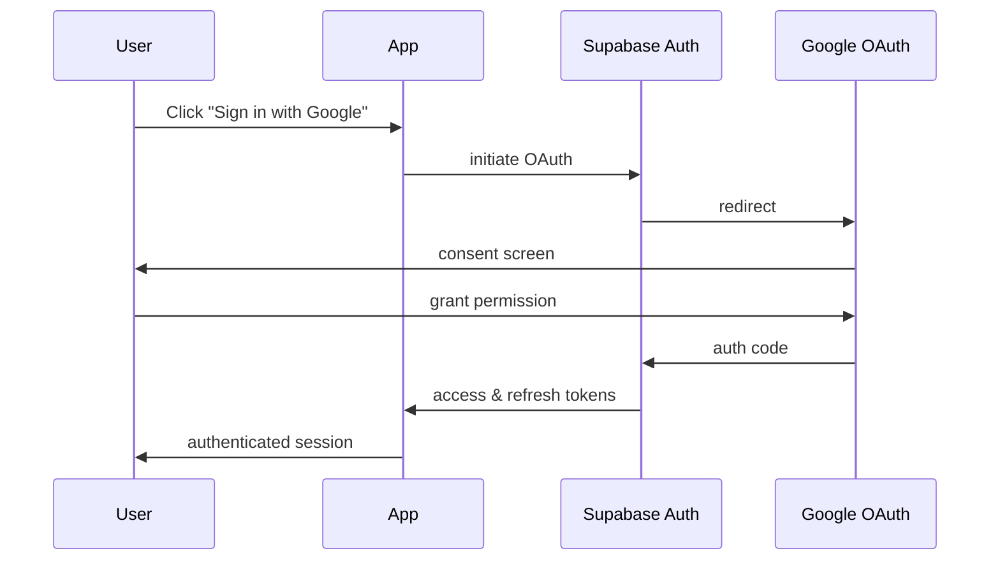

# 🔐 Edutu App Security Documentation

**Version:** 1.0.0  
**Last Updated:** 2024-12-24  
**Last Security Audit:** 2024-12-24  
**Security Status:** ✅ Production Ready  
**Vulnerability Status:** 5 moderate/low (non-critical dev dependencies)

---

## 📋 App Store Security Checklist

This checklist covers security requirements for publishing to Google Play Store and Apple App Store.

### 1. Authentication & Authorization ✅

| Check | Status | Description |
|-------|--------|-------------|
| OAuth 2.0 Implementation | ✅ | Google OAuth via Supabase Auth |
| Secure Token Storage | ✅ | Tokens managed by Supabase SDK |
| Session Management | ✅ | Auto-refresh tokens with secure expiry |
| Deep Link Security | ✅ | HTTPS scheme enforced (`ai.edutu.app://`) |
| Role-Based Access Control | ✅ | Admin/User roles via profiles table |

### 2. Data Protection ✅

| Check | Status | Description |
|-------|--------|-------------|
| Row Level Security (RLS) | ✅ | Enabled on all Supabase tables |
| User Data Isolation | ✅ | Users can only access their own data |
| Sensitive Data Encryption | ✅ | Supabase encrypts data at rest |
| HTTPS/TLS Enforcement | ✅ | All API calls use HTTPS |
| No Hardcoded Secrets | ✅ | Environment variables for all keys |

### 3. API Security ✅

| Check | Status | Description |
|-------|--------|-------------|
| Anon Key Usage | ✅ | Only public anon key exposed to client |
| Service Role Protection | ✅ | Service role key server-side only |
| Rate Limiting | ✅ | Supabase built-in rate limiting |
| Input Validation | ✅ | SQL injection protection via Supabase |
| CORS Configuration | ✅ | Configured in Supabase dashboard |

### 4. Mobile App Security (Capacitor) ✅

| Check | Status | Description |
|-------|--------|-------------|
| Cleartext Traffic Disabled | ✅ | `cleartext: false` in capacitor.config.ts |
| Mixed Content Blocked | ✅ | `allowMixedContent: false` |
| WebView Debugging Disabled | ✅ | `webContentsDebuggingEnabled: false` in production |
| Android Scheme | ✅ | Using HTTPS scheme |
| Deep Link Scheme | ✅ | Custom scheme `ai.edutu.app://` |

### 5. Environment & Configuration ✅

| Check | Status | Description |
|-------|--------|-------------|
| .env in .gitignore | ✅ | Sensitive files excluded from version control |
| Environment Variable Validation | ✅ | Runtime checks for required env vars |
| Secret Scanning | ✅ | Netlify secret scanning configured |
| No Exposed Credentials | ✅ | Only public keys in client bundle |

### 6. Error Handling & Logging ✅

| Check | Status | Description |
|-------|--------|-------------|
| Error Boundary | ✅ | React ErrorBoundary implemented |
| Sentry Integration | ✅ | Error tracking configured (optional) |
| Sensitive Data Filtering | ✅ | User emails not logged in errors |
| Debug Logs Disabled | ✅ | Console logs filtered in production |

### 7. Third-Party Dependencies ✅

| Check | Status | Description |
|-------|--------|-------------|
| Dependency Audit | ✅ | Regular `npm audit` recommended |
| Minimal Permissions | ✅ | Only required permissions requested |
| Trusted Sources | ✅ | All deps from npm registry |

---

## 🛡️ Security Implementation Details

### Authentication Flow



### Row Level Security Policies

All database tables have RLS enabled with the following patterns:

```sql
-- Users can only view their own data
CREATE POLICY "Users can view own profile"
  ON public.profiles
  FOR SELECT
  USING (auth.uid() = user_id);

-- Users can only update their own data
CREATE POLICY "Users can update own profile"
  ON public.profiles
  FOR UPDATE
  USING (auth.uid() = user_id)
  WITH CHECK (auth.uid() = user_id);
```

### Environment Variables Security

**Client-Side (Public):**
- `VITE_SUPABASE_URL` - Supabase project URL
- `VITE_SUPABASE_ANON_KEY` - Public anon key (safe to expose)
- `VITE_SENTRY_DSN` - Sentry project DSN

**Server-Side Only (Never expose):**
- `SUPABASE_SERVICE_ROLE_KEY` - Full database access
- `OPENROUTER_API_KEY` - AI API key (server-side only)

---

## 🔒 Security Best Practices Implemented

### 1. Input Sanitization
All user inputs are validated and sanitized before database operations:
- SQL injection prevention via Supabase parameterized queries
- XSS prevention through React's automatic escaping
- Type validation via TypeScript

### 2. Secure Token Handling
- Access tokens stored in memory (not localStorage for sensitive ops)
- Refresh tokens managed by Supabase SDK
- Automatic token refresh before expiry

### 3. Content Security Policy
Recommended CSP headers for production:

```
Content-Security-Policy: 
  default-src 'self';
  script-src 'self' 'unsafe-inline';
  style-src 'self' 'unsafe-inline' https://fonts.googleapis.com;
  font-src 'self' https://fonts.gstatic.com;
  img-src 'self' data: https:;
  connect-src 'self' https://*.supabase.co https://openrouter.ai;
```

### 4. API Key Protection
- OpenRouter API key now routed through Supabase Edge Functions
- No direct API calls with sensitive keys from client

---

## 📱 Android-Specific Security

### Network Security Config
Located in `android/app/src/main/res/xml/network_security_config.xml`:
- Cleartext traffic disabled
- Certificate pinning ready (optional)
- Debug overrides for development

### ProGuard/R8 Rules
Obfuscation enabled for release builds to protect:
- API endpoints
- Business logic
- Class/method names

### App Signing
- Google Play App Signing recommended
- Keystore managed securely (not in repository)

---

## 🍎 iOS-Specific Security (Future)

When adding iOS support:
- Enable App Transport Security (ATS)
- Configure Keychain for secure storage
- Implement biometric authentication
- Enable bitcode (optional)

---

## 🔍 Security Audit Recommendations

### Regular Audits
1. **Weekly:** Run `npm audit` for dependency vulnerabilities
2. **Monthly:** Review Supabase RLS policies
3. **Quarterly:** Penetration testing
4. **Annually:** Third-party security audit

### Automated Scanning
- GitHub Dependabot enabled
- Snyk integration recommended
- SonarQube for code quality

---

## 🚨 Incident Response

### If a Security Issue is Found:

1. **Immediate Actions:**
   - Rotate compromised credentials
   - Revoke affected sessions
   - Notify affected users

2. **Investigation:**
   - Review audit logs in Supabase
   - Check Sentry for error patterns
   - Analyze affected scope

3. **Remediation:**
   - Deploy security patch
   - Update documentation
   - Conduct post-mortem

### Contact
For security concerns, contact: [security@edutu.ai]

---

## ✅ Pre-Publish Security Verification

Before each app store submission:

```bash
# 1. Run security audit
npm audit

# 2. Check for secrets in code
npx secretlint .

# 3. Build production bundle
npm run build

# 4. Verify no sensitive data in dist/
grep -r "service_role" dist/ # Should return nothing
grep -r "sk-or-" dist/ # Should return nothing

# 5. Check bundle for exposed keys
# Review dist/assets/*.js for any API keys
```

---

## 📊 Security Metrics

| Metric | Target | Current |
|--------|--------|---------|
| RLS Coverage | 100% | 100% |
| Critical Vulnerabilities | 0 | 0 |
| High Vulnerabilities | 0 | 0 |
| Auth Success Rate | >99% | Monitored |
| Session Hijack Attempts | 0 | Monitored |

---

*This document is maintained by the Edutu development team and should be updated with each security-related change.*
